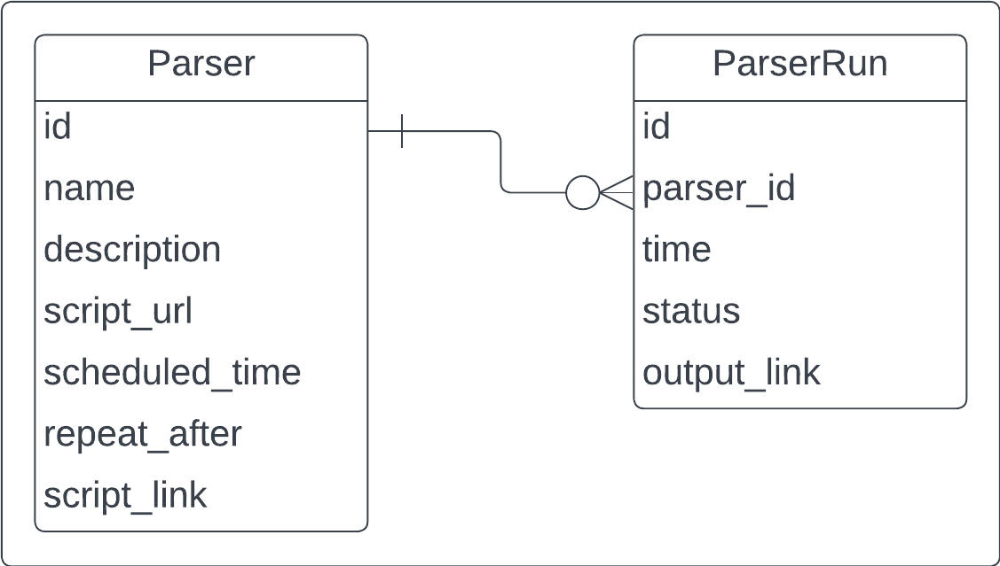

# Parseq. Приложение для запуска и оркестрации веб-парсеров

    

Приложение, содержащее логику управления веб-парсерами (автоматический запуск по расписанию, ручной запуск).

**Основные технологии: [Django](https://github.com/django/django), [Dramatiq](https://github.com/Bogdanp/dramatiq).**

### Требования

1. Пользователь может написать в *файле проекта* скрипт парсера. Через веб-интерфейс он может поставить его на расписание, выключить автоматический запуск и запустить вручную.
2. Каждый парсер имеет название, описание и путь до скрипта, который необходимо выполнить.
3. Пользователь может посмотреть данные по запускам парсеров (время, статус - выполнен, ожидание, ошибка).
4. Несколько простых парсеров (минимум 2) для демонстрации работы приложения. Это может быть парсер погоды, курса валют и т.п.
5. Минимум 2 теста.
6. Для запуска парсеров используется Dramatiq.
7. Возможность выгружать файлы-результаты работы парсеров с помощью REST API.
8. Оформление по [PEP8](https://peps.python.org/pep-0008/).
9. Документация в `README.md` c описанием, стэком, инструкцией по запуску приложения и тестов.

### Стэк

- Python
- Django
- Dramatiq
- UnitTest
- RabbitMQ
- PostgreSQL
- Docker
- Pulumi
- Yandex Cloud

### Описание

Приложение, база данных [PostgreSQL](https://www.postgresql.org/), брокер [RabbitMQ](https://www.rabbitmq.com/), развернуты в [Docker](https://www.docker.com/) на виртуальной машине на [Yandex Cloud](https://yandex.cloud/ru/). Доступно по адресу [https://parseq.sergei-kiprin.ru](https://parseq.sergei-kiprin.ru). Для хранения скриптов и файлов используется S3 Object Storage.

Приложение управляется с помощью панели адмиистратора Django. Помимо стандартного класса `User` в ней зарегистрированы классы `Parser` и `ParserRun`. `Parser` содержит обязательное поле `name`, текстовое поле `description`, обязательный файл `script` в формате `.py`, поля для конфигурации автоматического запуска (`scheduled_time`, `repeat_after`), кнопку для ручного запуска. Пользователь может создавать объекты класса `Parser` и настраивать их. `ParserRun` содержит поля `time`, `status` (enum - `pending`, `completed`, `error`), внешний ключ на объект `Parser` и файл `output` с текстом результата или ошибки.

Скрипты парсеров пишутся на языке Python в файле с форматом `.py`. *Вероятно нужно предусмотреть выбор устанавливаемых библиотек? Запускать скрипт в отдельном окружении? Отдельном контейнере Docker? Cloud Functions? Serverless Containers? Придется загружать библиотеки каждый раз? Предусмотреть запуск с разными аргументами? С секретами?* Предусмотрена возможность обращаться к объекту с контекстом запуска. Предусмотрен интерфейс для вывода результата - функция, которая позволяет записывать данные в стандартный файл `output.txt`.

После настройки автоматического запуска или активирования ручного запуска парсеры ставятся в очередь в RabbitMQ. По достижению своей очереди парсер запускается и создается объект `ParserRun` со статусом `pending`. После завершения работы `ParserRun` меняет статус на `completed` или `error`, появляется возожность выгрузить результаты.

Реализованы два парсера - парсер "любимых" треков пользователя из Yandex Music и парсер, проверяющий наличие оценки за вступительный экзамен на сайте [https://priem.urfu.ru/lk](https://priem.urfu.ru/lk).

Для тестирования используются возможности `django.test` и библиотека [UnitTest](https://docs.python.org/3/library/unittest.html).

### ER-диаграмма базы данных

### Инструкция по запуску

*Инструкция по запуску приложения (в docker-compose) и тестов.*
